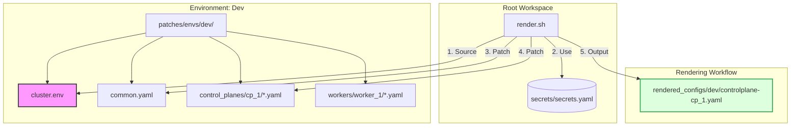

# Architecture Analysis: Talos GitOps-like Deployment

This document provides a technical evaluation of the current Talos Linux cluster management setup and outlines strategic improvements to move towards a more robust, production-ready GitOps workflow.

## 1. Current State Assessment

The current architecture implements a **Modular Configuration Engine** for Talos Linux. It successfully decouples static cluster definitions from node-specific hardware and networking configurations.

### Key Strengths
*   **Modular Patching:** The separation of `common.yaml` from node-specific patches (e.g., `patches/control_planes/cp_1/*.yaml`) is a best practice. It prevents configuration drift and allows for easy scaling.
*   **Variable Injection:** Using `cluster.env` and `render.sh` to inject versions and endpoints ensures consistency across the entire cluster.
*   **Modern Networking:** The implementation of Cilium as a CNI with `kubeProxyReplacement: true` and `l2announcements: true` demonstrates a high-performance, modern networking approach suitable for bare-metal/KVM environments.
*   **Separation of Concerns:** The directory structure clearly distinguishes between base configs, secrets, patches, and rendered outputs.

### Visual Architecture Diagram


---

## 2. Proposed Improvements

To transition from a "scripts-based" setup to a "true" GitOps/IaC workflow, the following improvements are recommended:

### A. Infrastructure as Code (IaC) for Virtual Machines
Currently, VM creation is documented via manual `virt-install` commands in `helper.md`.
*   **Recommendation:** Implement **Terraform/OpenTofu** using the `libvirt` provider.
*   **Impact:** This enables "one-click" infrastructure. You can define MAC addresses in Terraform and map them to static IPs in your Talos patches, ensuring predictable networking.

### B. Secrets Management (SOPS + AGE)
The `secrets/secrets.yaml` file currently stores sensitive Talos cluster data in plain text.
*   **Recommendation:** Use **Mozilla SOPS** with **AGE** encryption.
*   **Impact:** Encrypt secrets before committing to Git. Modify `render.sh` to decrypt them on-the-fly using `sops exec-file`. This is the cornerstone of secure GitOps.

### C. Unified Task Execution (Taskfile)
As the number of steps increases (Render -> Apply -> Bootstrap -> Helm Install), bash scripts can become difficult to maintain and lack dependency tracking.
*   **Recommendation:** Replace/augment `render.sh` with a **[Taskfile](https://taskfile.dev/)**.
*   **Impact:** Provides a cleaner CLI (e.g., `task cluster:up`) and allows for conditional execution (e.g., only render if patches have changed).

### D. Automated Configuration Validation
Misconfigured YAML patches can lead to failed boot cycles.
*   **Recommendation:** Integrated `talosctl validate` into the rendering pipeline.
*   **Impact:** Every render will automatically verify the syntax and mode (`metal`) against the Talos schema before any deployment happens.

### E. Native Talos Extensions & Helm Integration
Cilium is currently managed as a post-install manual step.
*   **Recommendation:** Move Cilium configuration into **Talos System Extensions** or use the `cluster-discovery` feature for auto-deployment.
*   **Impact:** Makes the cluster truly self-contained. A new node joining the cluster becomes fully operational with its CNI configured automatically.

### F. Multi-Environment Support
The current structure is optimized for a single cluster (`gg-talos`).
*   **Recommendation:** Evolve the `patches/` directory to support environments (e.g., `patches/dev/`, `patches/prod/`).
*   **Impact:** Reuse common patches across different clusters while maintaining separate variable files.

---

## 3. Next Steps

1.  **Initialize SOPS:** Secure the secrets directory.
2.  **Develop Terraform Modules:** Automate the KVM node creation.
3.  **Port to Taskfile:** Standardize the developer workflow.

---

## 4. Multi-Environment Implementation Details

To handle multiple environments (like `dev`, `staging`, and `prod`) effectively, the configuration logic should move from a "flat" structure to a "hierarchical" one.

### A. Environment-Specific Variables (Cluster Name & Endpoint)
Each environment needs its own `cluster.env` file. These variables drive the global cluster identity.
*   **Dev:** `CLUSTER_NAME=talos-dev`, `CLUSTER_ENDPOINT=https://10.0.1.10:6443`
*   **Prod:** `CLUSTER_NAME=talos-prod`, `CLUSTER_ENDPOINT=https://10.1.1.10:6443`

The `render.sh` script should be modified to accept an environment argument (e.g., `./render.sh dev`) which determines which variable file to source and which patch directory to target.

### B. Hierarchical Patching (IPs & Hostnames)
IP addresses and hostnames are environment-specific. You can handle this by creating environment-specific patch folders while keeping a globally shared `common.yaml`.

#### Proposed Directory Structure (Nested & Per-Env Common):
```text
.
├── patches/
│   └── envs/
│       ├── dev/
│       │   ├── cluster.env     <-- CLUSTER_NAME: talos-dev
│       │   ├── common.yaml     <-- Shared across all DEV nodes
│       │   ├── control_planes/
│       │   │   └── cp_1/       <-- Dev IP (192.168.1.10)
│       │   └── workers/
│       └── prod/
│           ├── cluster.env     <-- CLUSTER_NAME: talos-prod
│           ├── common.yaml     <-- Shared across all PROD nodes
│           ├── control_planes/
│           │   └── cp_1/       <-- Prod IP (10.1.1.10)
│           └── workers/
├── secrets/                    <-- Encrypted secrets
└── render.sh                   <-- Modified to take env argument
```

### C. Execution Logic for IP Management
The `render.sh` (or Taskfile) logic would follow this priority:
1.  **Global Secrets:** `secrets/secrets.yaml`
2.  **Env Common Patch:** `patches/envs/$ENV/common.yaml`
3.  **Env-Node Patches:** `patches/envs/$ENV/$ROLE/$NODE/*.yaml` (contains specific IPs or disks)

This approach ensures that **application logic is shared** but **infrastructure data is strictly isolated**.

## 5. Automation and Workflow
The `render.sh` script now automatically generates a deployment helper at `rendered_configs/<env>/apply.sh`. This script:
- Exports the correct `TALOSCONFIG`.
- Executes `talosctl apply-config` with the correct IP and file for every node in the environment.
- Provides the exact `talosctl bootstrap` command for the first control plane.
